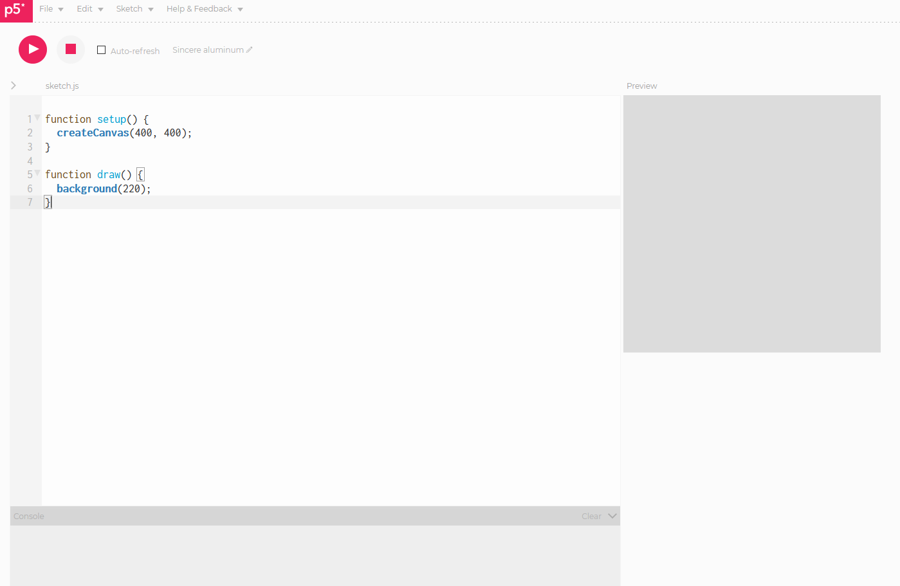

## p5.js szerkesztő

### Felület
Nyissuk meg a [p5 Web Editor](https://editor.p5js.org/)



Így néz ki maga a [p5 Web Editor](https://editor.p5js.org/). Három fő része van
a felületnek. Maga a szövegszerkesztő (Editor) ahova magát a kódot írjuk. Tőle jobbra
egy *Preview* felirattal jelzett jelenleg még szürke négyzet ahol majd a programunk
vizuális eredményét tudjuk majd megfigyelni. Illetve alul helyezkedik el a konzol (Console) ahol a szöveges kimenteket tudjuk majd megfigyelni. Itt fog megjelenni minden esetleges hiba amit a program írása során vétettünk.

Ha pedig a programunkat szeretnénk kipróbálni akkor azt a fenti Play gombbal tudjuk elindítani és a Stop gombbal leállítani.

### Alap program struktúra
Ahogy látjuk alapvetően két függvényünk van a kezdő programban megírva. A setup és a draw.
```JavaScript
function setup() {
  createCanvas(400, 400);
}

function draw() {
  background(220);
}
```
Mit is csinálnak? Röviden a **setup** függvénybe fog minden olyan utasítás kerülni
amit a program kezdetekor szeretnénk egyszer végrehajtani.
A **draw**-ba minden egyéb amit pedig minden rajzolási körben újra és újra meg
szeretnénk csinálni.

Próbáljuk ki mit is jelent ez. A **draw** függvény nélkül hogy viselkedik az alábbi:
```JavaScript
function setup() {
  createCanvas(400, 400);
  background(125);
  line(200, 200, mouseX, mouseY);
}
```
Azt látjuk, hogy keletkezett egy 400 pixel széles és magas ablak. Aminek a háttér színét közepes erősségű szürkére állítottuk. Majd rajzoltattunk egy vonalat a (200, 200)-as pontból az egér aktuális helyzetéig. De ezzel valami nincs rendjén!
Az egerünk nem is ott van amikor elindítjuk és nem is csak egy statikus képet szeretnénk látni.

Mozgassuk át egy kicsit a kódot és nézzük meg mi lesz ha a már a draw függvényben
állítjuk be a hátteret és rajzolunk ki egy vonalat.

```JavaScript
function setup() {
  createCanvas(400, 400);
}

function draw() {
  background(125);
  line(200, 200, mouseX, mouseY);
}
```

Ez mindjárt jobb! A vonal követi az egér helyzetét és nem csak egy sima képet látunk.
Ahogy látjuk bár meg tudjuk ugyan azt csinálni mind a két függvényben, az nem ugyan azt az eredményt fogja hozni. Egy közepes túlzással úgy is tekinthetünk a **setup**-ra
mint ami meghatározza hogy nézzen ki a program felülete, mint például a képernyő mérete.
Míg a **draw**-ra mint ami leírja mi jelenyen meg minden kirajzoláskor azon a felületen.

### Koordináta rendszer és a konzol
Mivel elsődleges célunk valami megjelenítése lesz. Érdemes tisztában lennünk a koordináta rendszerrel amit a Processing használ.

Erre kísérletezésképpen az alábbi program kiváló:
```JavaScript
function setup() {
  createCanvas(400, 400);
}

function draw() {
  background(125);
  line(200, 200, mouseX, mouseY);
  print("x: " + mouseX + ", y: " + mouseY);
}
```
Az előbbihez képest csak annyit változtattunk, hogy kiírjuk az egér aktuális helyzetének X és Y koordinátáit a konzolra.
Figyeljük meg hogy változnak az értékek a Console-on:


 - Ball felső sarok: x: 0, y: 0
 - Jobb felső sarok: x: 400, y: 0
 - Bal alsó: x: 0, y: 400
 - Jobb alsó: x: 400, y: 400

Itt a koordináta rendszer majdnem olyan mint a matematikából megszokott Descartes féle. Csak trükkösen meg van egy kicsit csavarva és az **y** tengely fejjel lefelé áll. Erre mindig érdemes emlékeztetnünk magunkat, mert könnyen kimehet a fejünkből és hosszas percek mehetnek el a hibakutatással.

A konzol pedig a nagy barátunk! Amikor nem vagyunk biztosak egy változó pillanatnyi értékében azt érdemes kiíratni a képernyőre. A legkönnyebben ezt pedig a konzol segítségével lehet. Erre a **print** függvény a legegyszerűbb eszköz.

## Példaprogram

```JavaScript
function setup() {
 createCanvas(500, 500);
 colorMode(HSB, 180, 100, 100, 1);
 angleMode(DEGREES);
 noFill();
}

function draw() {
 background(220);
 let recentered_x = mouseX - 250;
 let recentered_y = mouseY - 250;
 let distance = sqrt( pow(recentered_x, 2) + pow(recentered_y, 2));
 for(let d = 0; d < 800; d+=15){
   let s = distance % 15;
   let hue = acos( (recentered_x + recentered_y) / (distance * sqrt(2)) );
   stroke(hue, 100, 100);
   ellipse(250, 250, d + s, d + s);
 }
}
```
Ha minden igaz valami ilyesmit kéne látnunk:


Miután kipróbáltuk a kódot és láttuk mi történik próbáljuk meg az egyes részleteket
módosítani. Törölgessünk ki belőle sorokat. Mik történnek? Próbáljuk meg módosítani
valamilyen egyéb módon.
Például:
1. Mi lesz ha kitörüljük a **noFill()** sort?
3. Mi lesz ha kitörüljük a **background(220)** sort?
3. Növeljük meg a koncentrikus körök távolságát
4. Toljuk el az origót
5. Meg tudjuk e mondani hogy keletkeznek a színek
